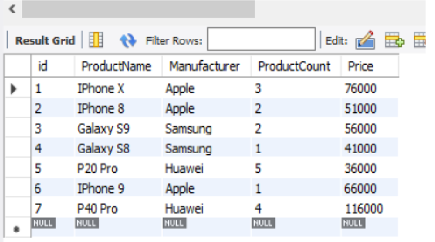
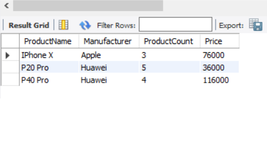
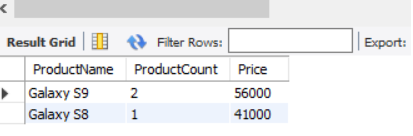
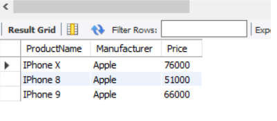
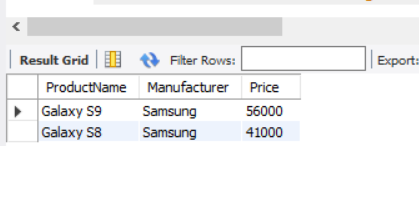
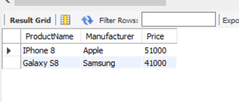

# Задача

1. Создайте таблицу с мобильными телефонами, используя графический интерфейс. Заполните БД данными.
Добавьте скриншот на платформу в качестве ответа на ДЗ

 2. Выведите название, производителя и цену для товаров, количество которых превышает 2 (SQL - файл, скриншот, либо сам код)

3. Выведите весь ассортимент товаров марки “Samsung”

4. С помощью регулярных выражений найти:  
    4.1. Товары, в которых есть упоминание "Iphone"  
	4.2. "Samsung"  
	4.3.  Товары, в которых есть ЦИФРА "8"

# Решение
### Задание 1
<u>Создаем БД и таблицу</u>
~~~~sql
CREATE database phones;
USE phones;
CREATE table cellular_phones
(id INT Primary Key Not NULL AUTO_INCREMENT,
ProductName varchar(30) Not NULL,
Manufacturer varchar(30) Not NULL,
ProductCount INT Not NULL,
Price INT Not Null
);
~~~~
<u>Заполняем таблицу данными</u>
~~~~sql
INSERT cellular_phones
(
ProductName,Manufacturer,ProductCount,Price
)
VALUES
('IPhone X','Apple',3,76000),
('IPhone 8','Apple',2,51000),
('Galaxy S9','Samsung',2,56000),
('Galaxy S8','Samsung',1,41000),
('P20 Pro','Huawei',5,36000),
('IPhone 9','Apple',1,66000),
('P40 Pro','Huawei',4,116000);
~~~~

### Задание 2
~~~~sql
SELECT ProductName,Manufacturer,Price FROM cellular_phones
WHERE ProductCount > 2;
~~~~

### Задание 3
~~~~sql
SELECT ProductName, ProductCount,Price FROM cellular_phones
WHERE Manufacturer = 'Samsung';
~~~~

### Задание 4  
4.1 
~~~~sql
SELECT ProductName,Manufacturer,Price FROM cellular_phones
WHERE ProductName LIKE 'Iphone%';
~~~~

4.2  
~~~~sql
SELECT ProductName,Manufacturer,Price FROM cellular_phones
WHERE Manufacturer LIKE 'Samsung';
~~~~

4.3  
~~~~sql
SELECT ProductName,Manufacturer,Price FROM cellular_phones
WHERE ProductName REGEXP '8';
~~~~~
