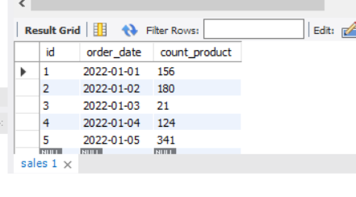

# Задание 2 семинара
###  1. Используя операторы языка SQL, создайте таблицу “sales”. Заполните ее данными
### 2. Для данных таблицы “sales” укажите тип заказа в зависимости от кол-ва : меньше 100  -    Маленький заказ, от 100 до 300 - Средний заказ, больше 300  -     Большой заказ
### 3. Создайте таблицу “orders”, заполните ее значениями. Выберите все заказы. В зависимости от поля order_status выведите столбец full_order_status: OPEN – «Order is in open state» ; CLOSED - «Order is closed»; CANCELLED -  «Order is cancelled»
### 4*. Чем 0 отличается от NULL? Напишите ответ в комментарии к домашнему заданию на платформе

# Решение
## Задание №1
~~~~sql
-- Создаем БД
CREATE DATABASE seminar2;
-- Подключаем БД
USE seminar2;
-- Создаем таблицу
CREATE TABLE sales
(
id INT PRIMARY KEY NOT NULL AUTO_INCREMENT,
order_date DATE NOT NULL,
count_product INT NOT NULL
);
-- Заполняем таблицу
INSERT INTO sales 
(
order_date, count_product
)
VALUES
('2022-01-01', 156),
('2022-01-02',180),
('2022-01-03',21),
('2022-01-04',124),
('2022-01-05',341);
~~~~

## Задание №2
### 1 вариант реализации:
~~~~sql
SELECT
 id AS 'id заказа',
CASE 
WHEN count_product <100 THEN 'Маленький заказ'
WHEN count_product >300 THEN 'Большой заказ'
ELSE 'Средний заказ'
END AS 'Тип заказа'
FROM sales;
~~~~

### 2 вариант реализации
~~~~sql
SELECT 
id AS 'id заказа',
IF (count_product < 100,'Маленький заказ',
	IF (count_product > 300,'Большой заказ','Средний заказ'))
AS 'Тип заказа'
FROM sales;
~~~~

## Задание №3
~~~~sql
--Создаем таблицу
CREATE TABLE orders
(
id INT NOT NULL PRIMARY KEY AUTO_INCREMENT,
employee_id CHAR(3) NOT NULL,
amount DECIMAL(5,2) NOT NULL,
order_status TINYTEXT NOT NULL
);
INSERT INTO orders
(
employee_id,amount,order_status
)
VALUES
('e03',15.00,'OPEN'),
('e01',25.50,'OPEN'),
('e05',100.70,'CLOSED'),
('e02',22.18,'OPEN'),
('e04',9.50,'CANCELLED');
~~~~

### Добавляем full_order_status, 1 вариант реализации
~~~~sql
UPDATE orders
SET full_order_status = 
CASE 
WHEN order_status = 'CANCELLED' THEN 'Order is cancelled'
WHEN order_status = 'OPEN' THEN 'Order is in open state'
WHEN order_status =  'CLOSED' THEN 'Order is closed'
END;
~~~~

### 2 вариант реализации
~~~~sql
UPDATE orders
SET full_order_status = 
IF (order_status = 'OPEN', 'Order is in open stat', 
IF (order_status = 'CLOSED','Order is closed','Order is Cancelled'));
~~~~

## Задание №4
Значение NULL в MySQL  – это отсутствие значения(напрнимер не существует значения, которое может быть присвоено)  
0 - может быть результатом операции  
