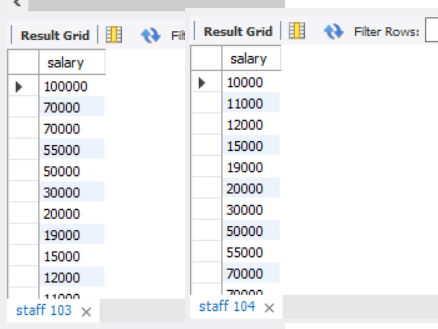

# Задание к семинару №3
## Условие:
1. Выведите id сотрудников, которые напечатали более 500 страниц за всех дни
2. Выведите дни, когда работало более 3 сотрудников Также укажите кол-во сотрудников, которые работали в выбранные дни.
3. Выведите среднюю заработную плату по должностям, которая составляет более 30000
4. Отсортируйте данные по полю заработная плата (salary) в порядке: убывания; возрастания
5. Выведите 5 максимальных заработных плат (salary)  
6. Посчитайте суммарную зарплату (salary) по каждой специальности (роst)
7. Найдите кол-во сотрудников с специальностью (post) «Рабочий» в возрасте от 24 до 49 лет включительно.  
8. Найдите количество специальностей
9. Выведите специальности, у которых средний возраст сотрудников меньше 30 лет  
(По таблице "staff" 3 семинар)

## Решение
### Условие 1
~~~~sql
SELECT staff_id, sum(count_pages)
FROM activity_staff
GROUP BY staff_id
HAVING SUM(count_pages) >500;
~~~~

### Условие 2
~~~~sql
SELECT date_activity AS 'Дата', count(DISTINCT staff_id) AS 'Количество работников'
FROM activity_staff
group by date_activity
HAVING count(DISTINCT staff_id)>3;
~~~~

### Условие 3
~~~~sql
SELECT avg(salary) , post
FROM staff
Group BY post
HAVING avg(salary) >30000;
~~~~

### Условие 4
~~~~sql
-- Сортировка по возрастанию
SELECT salary 
FROM staff
ORDER BY salary;
~~~~

~~~~sql
-- Сортировка по убыванию
SELECT salary 
FROM staff
ORDER BY salary DESC;
~~~~

### Условие 5
~~~~sql
SELECT salary AS 'Максимальные зарплаты'
FROM staff
ORDER BY salary DESC
LIMIT 5;
~~~~

### Условие 6
~~~~sql
SELECT sum(salary) as 'Суммарная зарплата', post AS 'Специальность'
FROM staff
GROUP BY post;
~~~~

### Условие 7
~~~~sql
SELECT count(post) AS 'Количестов рабочих от 24 до 49 лет'
FROM staff
WHERE age BETWEEN 24 AND 49 AND post = 'Рабочий';
~~~~

### Условие 8
~~~~sql
SELECT count(DISTINCT post) AS 'Количество специальностей'
FROM staff;
~~~~

### Условие 9
~~~~sql
SELECT post, AVG(age)
FROM staff
GROUP BY post
HAVING AVG(age) <30; 
# Средний возраст всех специальностей выше или равен 30
~~~~

~~~~sql
Проверка среднего возраста по специальностям
SELECT post, AVG(age) AS 'Средний возраст'
FROM staff
GROUP BY post; 
~~~~
