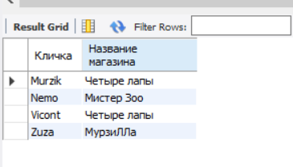
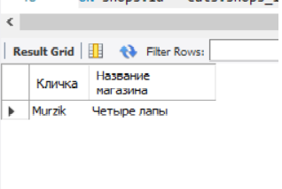
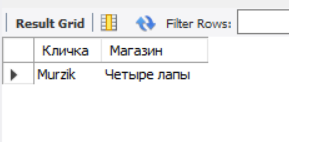
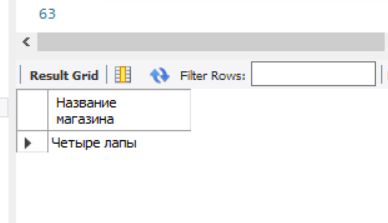
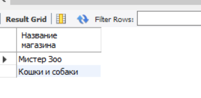
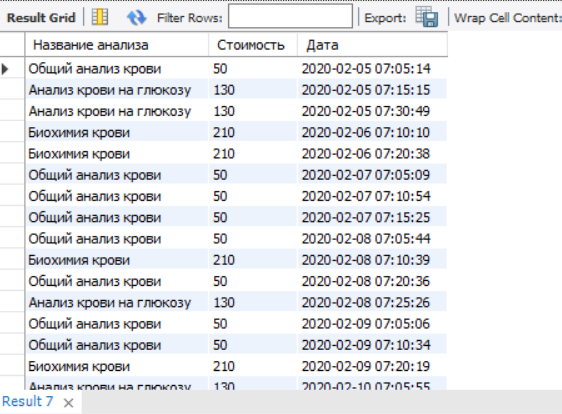

# Задание к семинару 4
## Условие
Используя JOIN-ы, выполните следующие операции:
1. Вывести всех котиков по магазинам по id (условие соединения shops.id = cats.shops_id)
2. Вывести магазин, в котором продается кот “Мурзик” (попробуйте выполнить 2 способами)
3. Вывести магазины, в которых НЕ продаются коты “Мурзик” и “Zuza”
 
4. Вывести название и цену для всех анализов, которые продавались 5 февраля 2020 и всю следующую неделю.
Есть таблица анализов Analysis:  
an_id — ID анализа;  
an_name — название анализа;  
an_cost — себестоимость анализа;  
an_price — розничная цена анализа;  
an_group — группа анализов.  
Есть таблица групп анализов Groups:  
gr_id — ID группы;  
gr_name — название группы;  
gr_temp — температурный режим хранения.  
Есть таблица заказов Orders:  
ord_id — ID заказа;  
ord_datetime — дата и время заказа;  
ord_an — ID анализа.  

## Решение
### Условие 1
~~~~sql
SELECT cats.`name` AS 'Кличка', shops.shopname AS 'Название магазина'
FROM cats 
INNER JOIN shops
ON shops.id = cats.shops_id;
~~~~

### Условие 2
*Первый вариант решения*
~~~~sql
SELECT cats.`name` AS 'Кличка', shops.shopname AS 'Название магазина'
FROM cats
LEFT OUTER JOIN shops
ON shops.id = cats.shops_id
WHERE cats.`name` = 'Murzik';
~~~~

*Второй вариант решения*
~~~~sql
SELECT cats.`name` AS 'Кличка', shops.shopname AS 'Магазин'
FROM cats, shops
WHERE  cats.shops_id = shops.id AND cats.`name` = 'Murzik';
~~~~

*Третий вариант решения*  
*(Выдаст только название магазина)*
~~~~sql
SELECT shopname AS 'Название магазина'
FROM shops
WHERE EXISTS (SELECT `name` FROM cats
WHERE cats.shops_id = shops.id AND cats.`name` = 'Murzik');
~~~~

### Условие 3
*Вариант 1*
~~~~sql
SELECT shopname AS 'Название магазина'
FROM shops 
LEFT OUTER JOIN cats 
ON shops.id = cats.shops_id
AND cats.`name` IN ('Murzik','Zuza')
WHERE cats.`name` IS NULL;
~~~~

*Вариант 2*
~~~~sql
SELECT shopname AS 'Название магазина'
FROM shops
WHERE NOT EXISTS (SELECT `name` FROM cats
WHERE cats.shops_id = shops.id AND (cats.`name` = 'Murzik' OR cats.`name` = 'Zuza'));
~~~~

### Условие 4
~~~~sql
SELECT an_name AS 'Название анализа', an_price AS 'Стоимость', ord_datetime AS 'Дата'
FROM analysis
LEFT OUTER JOIN orders
ON orders.ord_an = analysis.an_id
WHERE ord_datetime
BETWEEN '2020.02.05 00:00:00' AND '2020.02.14 00:00:00'
ORDER BY ord_datetime;
~~~~
