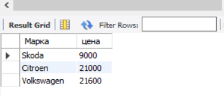
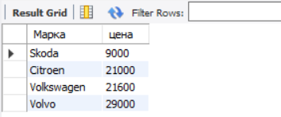
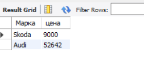

# Задание к семинару 5
## Условие
1. Создайте представление, в которое попадут автомобили стоимостью до 25 000 долларов
2. Изменить в существующем представлении порог для стоимости: пусть цена будет до 30 000 долларов (используя оператор ALTER VIEW)
3. Создайте представление, в котором будут только автомобили марки “Шкода” и “Ауди”
## Решение
### Условие 1
~~~~sql
CREATE VIEW low_cost AS 
SELECT `name` AS 'Марка',
cost AS 'цена'
FROM cars
WHERE cost <25000;

~~~~

### Условие 2
~~~~sql
ALTER VIEW low_cost AS
SELECT`name` AS 'Марка',
cost AS 'цена'
FROM cars
WHERE cost <30000
ORDER BY `цена`; 
~~~~

### Условие 3
~~~~sql
CREATE VIEW skoda_audi_vehicles AS
SELECT `name` AS 'Марка',
cost AS 'цена'
FROM cars
WHERE `name` = 'Audi' OR `name` = 'Skoda'
ORDER BY `цена`;
~~~~~
