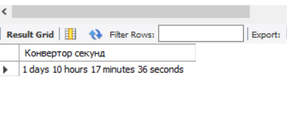
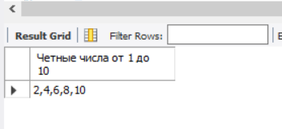

# Задание к семинару 6
## Условие
1. Создайте функцию, которая принимает кол-во сек и формат их в кол-во дней часов.  Пример: 123456 ->'1 days 10 hours 17 minutes 36 seconds '

2. Выведите только четные числа от 1 до 10.  
Пример: 2,4,6,8,10

## Решение
### Условие 1
~~~~sql
delimiter //
CREATE FUNCTION transform_time(seconds INT)
RETURNS VARCHAR(45)
DETERMINISTIC
BEGIN
    DECLARE days INT;
    DECLARE hours INT;
    DECLARE minutes INT;
    DECLARE formated_time VARCHAR(55);

    SET days = FLOOR(seconds / (24 * 3600));
    SET seconds = seconds % (24 * 3600);
    SET hours = FLOOR(seconds / 3600);
    SET seconds = seconds % 3600;
    SET minutes = FLOOR(seconds / 60);
    SET seconds = seconds % 60;
	SET formated_time = CONCAT(days, " days ", hours, " hours ", minutes, " minutes ", seconds, " seconds");
    RETURN formated_time;
END //
delimiter ;
SELECT transform_time(123456) AS 'Конвертор секунд';
~~~~

### Условие 2
~~~~sql
delimiter //
CREATE PROCEDURE even_num()
	BEGIN
    DECLARE num INT DEFAULT 1;
    DECLARE result VARCHAR(60) DEFAULT '';
    WHILE num <= 10 DO
        IF num % 2 = 0 THEN
            IF result = '' THEN
                SET result = num;
            ELSE
                SET result = CONCAT(result, ',', num);
            END IF;
        END IF;
        SET num = num + 1;
    END WHILE;
    SELECT result AS 'Четные числа от 1 до 10';
END //
DELIMITER ;

CALL even_num();
~~~~
